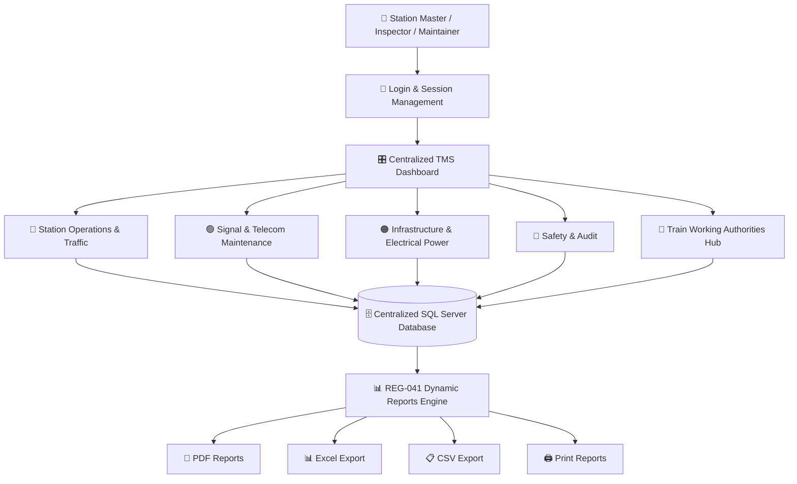
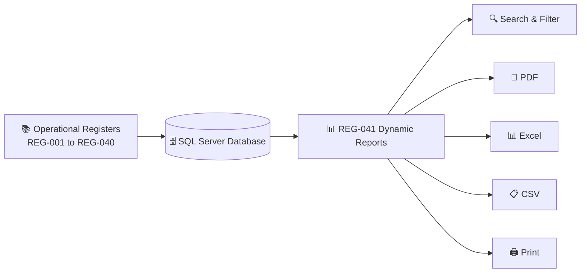

<div align="center">

# 🚆 INDIAN RAILWAYS — TRAIN MANAGEMENT SYSTEM (TMS)

### 🇮🇳 *Smart Digital Solution for Railway Station Registers & Centralized Operational Control*

<br/>

<!-- Animated Typing Banner -->
<a href="#">
  
</a>

<br/>

<!-- Technology Badges -->
<p align="center">

  

  

  

  

  

  

</p>

<br/>

---

</div>

# 🎯 Aim & Main Objective of the Project

The main objective of the **Train Management System (TMS)** is to safely monitor, control, and manage train movements by replacing manual railway registers with a centralized digital system.

The system stores train movement information, captures operational records, manages railway station registers, and generates reports for:

- 🚆 Train Operations
- 🛡️ Safety Monitoring
- 📋 Operational Control
- 🔍 Audits and Inspections
- 📊 Management Reporting

> **The goal is simple: Replace manual paperwork with a centralized, searchable, secure, and efficient digital railway management system.**

---

# 🌟 Why Train Management System (TMS)?

Traditional railway station operations depend on multiple physical paper registers maintained manually by Station Masters, Traffic Inspectors, and Signal & Telecom Maintainers.

The **Train Management System (TMS)** transforms this manual process into a centralized digital platform.

<table>
<tr>

<td width="48%" valign="top">

## 🛑 Traditional Paper System

❌ **41 separate physical registers**

❌ Risk of damaged, torn, or misplaced records

❌ Manual shift handovers

❌ Time-consuming inspection preparation

❌ Difficult to search old records

❌ Hundreds of pages must be checked manually

❌ Manual compilation of audit reports

</td>

<td width="4%" align="center">

# ➜

</td>

<td width="48%" valign="top">

## ⚡ Centralized Digital TMS

✅ **One centralized digital system**

✅ Permanent records stored in SQL Server

✅ Digital shift handovers with timestamps

✅ Faster inspection and audit preparation

✅ Real-time search across registers

✅ Easy access to historical records

✅ Instant PDF, Excel, and CSV reports

</td>

</tr>
</table>

---

> ## 🚀 Result
>
> **Instead of managing 41 separate paper registers, railway staff can manage operational information through one centralized Train Management System.**

---

# 🏛️ System Architecture Workflow



---

# 📋 The 41 Operational Registers

The Train Management System digitizes **41 important railway operational registers**.

They are organized into four major operational departments.

| Department | Registers | Main Purpose |
|---|:---:|---|
| 🔵 Station Operations & Traffic | 17 | Train operations, handovers, attendance, complaints |
| 🟢 Signal & Telecom Maintenance | 10 | Signal equipment, testing, failures, maintenance |
| 🟠 Infrastructure & Electrical Power | 4 | Power blocks, sidings, repairs, DG logs |
| 🔴 Safety & Audit Engine | 10 | Safety inspections, meetings, audits, reporting |
| **TOTAL** | **41** | **Centralized Railway Operational Management** |

---

# 🔵 Department 1: Station Operations & Traffic

### Total Registers: 17

> Safely manage daily train traffic, station operations, staff handovers, attendance, and passenger or employee grievances.

| Register Code | Register Name | Operational Scope & Tracked Information |
|---|---|---|
| `REG-001` | **Station Master's Diary** | Daily station operational log, category classification, event narrative, and reporting details. |
| `REG-002` | **Train Signal Register** | Train number, UP/DOWN direction, platform or line, arrival, departure, and passed times. |
| `REG-003` | **SWR Acknowledgment** | Station Working Rules acknowledgment, staff ID, rule version, reading date, and verifier details. |
| `REG-004` | **Caution Order Register** | Speed restrictions, section details, engineering reason, and validity period. |
| `REG-007` | **Bio-Metric Attendance** | Staff attendance, assigned shift, punch timestamps, and duty presence. |
| `REG-008` | **Stabled Load Register** | Train or rake ID, stabling line, stabled time, and handbrake safety checks. |
| `REG-011` | **Public Complaints** | Passenger details, ticket or PNR information, complaint category, and grievance details. |
| `REG-012` | **Staff Grievances** | Employee ID, issue type, grievance subject, and resolution remarks. |
| `REG-021` | **Complete Arrival Register** | Train number, arrival time, wagon count, guard ID, and Station Master verification. |
| `REG-022` | **Control Instructions** | Directives from the Section Controller, message type, validity period, and acknowledgment. |
| `REG-023` | **SM Relief Diary** | Relieving SM, relieved SM, handover time, pending operational issues, and weather information. |
| `REG-028` | **Staff Biodata & Training** | Employee information, medical examination, safety training, and competency expiry. |
| `REG-029` | **Assurance Register** | Safety circular acknowledgment, document information, rule version, and digital sign-off. |
| `REG-030` | **Private Number (PN) Sheet** | Private number exchanges, communication purpose, train number, and recipient Station Master. |
| `REG-032` | **Attendance Late Marks** | Shift timing compliance, late arrival remarks, and supervisor authorization. |
| `REG-033` | **Passenger Complaint Log** | Detailed passenger grievance tracking, PNR, department, and complaint status. |
| `REG-034` | **Employee Complaint Log** | Internal employee complaints, urgency level, and resolution status. |

---

# 🟢 Department 2: Signal & Telecom (S&T) Maintenance

### Total Registers: 10

> Tracks signaling equipment, point machines, interlocking tests, failures, and maintenance activities.

| Register Code | Register Name | Operational Scope & Tracked Information |
|---|---|---|
| `REG-005` | **Signal / Point / Block Failure** | Asset type, asset ID, failure time, reported maintainer, and rectification details. |
| `REG-006` | **S&T Discon / Recon** | Equipment disconnection permit, gear ID, maintainer details, approval, and reconnection time. |
| `REG-014` | **Miscellaneous Counter** | Emergency Route Release, Calling-on counters, old value, new value, and authorization reference. |
| `REG-016` | **Crank Handle Register** | Point number, crank handle ID, authorization number, operator details, and usage record. |
| `REG-017` | **Crank Handle Testing** | Handle ID, test date, test type, tester ID, and test outcome. |
| `REG-018` | **Cross-Over Testing** | Crossover identification, locking verification, detection verification, and maintainer details. |
| `REG-019` | **Signal Failure Register** | Signal ID, failure time, failure classification, root cause, and repair actions. |
| `REG-020` | **Emergency Key Register** | Emergency key ID, asset ID, checkout time, return time, and authorization details. |
| `REG-038` | **Joint Inspection** | Joint inspection involving departments, asset ID, measured values, and observations. |
| `REG-040` | **Failure Rectification** | Failure reference, root cause, repair actions, and post-repair testing result. |

---

# 🟠 Department 3: Infrastructure & Electrical Power

### Total Registers: 4

> Manages sidings, traffic and power blocks, maintenance work, and electrical power records.

| Register Code | Register Name | Operational Scope & Tracked Information |
|---|---|---|
| `REG-015` | **Siding Key Register** | Siding key ID, issued staff, purpose, checkout and return time, and safety checklist. |
| `REG-024` | **Traffic / Power Block** | Block type, section, granted time, and cancellation time. |
| `REG-031` | **Petty Repairs** | Asset category, asset ID, defect description, assigned department, and completion status. |
| `REG-035` | **Power Supply & DG Log** | Primary power source, failure time, DG running hours, and diesel fuel information. |

---

# 🔴 Department 4: Safety & Audit Engine

### Total Registers: 10

> Handles regulatory compliance, officer inspections, safety meetings, audits, and consolidated reporting.

| Register Code | Register Name | Operational Scope & Tracked Information |
|---|---|---|
| `REG-009` | **Fog Signalman Deployment** | Staff ID, deployment location, detonator count, and shift start and end times. |
| `REG-010` | **Night Inspection Register** | Inspecting officer, visit time, staff alertness, and night-working observations. |
| `REG-013` | **Inspection & Observations** | Inspection scope, deficiencies observed, and compliance due date. |
| `REG-025` | **Safety Meeting Register** | Meeting type, chairperson, attendees, agenda, minutes, and action items. |
| `REG-026` | **HQ Safety Circulars** | Circular reference, subject, effective date, and Station Master acknowledgment. |
| `REG-027` | **Safety Meeting Part 2** | Deliberations, safety directives, assigned staff, and deadlines. |
| `REG-036` | **Officers Inspection** | Officer inspection information, station details, irregularities, and priority. |
| `REG-037` | **Traffic Inspector (TI) Audit** | Audit findings, operational observations, rule violations, and instructions. |
| `REG-039` | **Night Inspection Part 2** | Signal visibility checks, safety equipment status, and corrective actions. |
| `REG-041` | **Consolidated Dynamic Reports** | Cross-register querying, date filtering, and PDF, Excel, CSV, and print reporting. |

---

# 🚦 Train Working Authorities Hub (22 Standardized Authorities)

The system includes dedicated digital generation and logging for all **22 Indian Railways operational authorities**:

| Authority Code | Standard Form | Operational Purpose |
|---|---|---|
| `AUTH-001` | **T/369-3b** | Advance Authority to Pass Defective Signal (Descriptive) |
| `AUTH-002` | **T/369-3b (ON)** | Authority to Pass Signal at 'ON' Position |
| `AUTH-003` | **T/409** | Caution Order (Speed Restrictions & Section Directives) |
| `AUTH-004` | **T/509** | Authority to Receive Train on Obstructed Line |
| `AUTH-005` | **T/510** | Authority to Receive Train on Non-Signalled Line |
| `AUTH-006` | **T/511** | Authority to Start Train from Non-Signalled Line |
| `AUTH-007` | **T/512** | Authority to Start Train from Line with Common Starter |
| `AUTH-008` | **T/A 602** | Authority for Relief Engine/Train to Enter Block Section |
| `AUTH-009` | **T/C 602** | Authority to Dispatch Train during Total Failure of Communications |
| `AUTH-010` | **TFC-1 / TFC-2** | Line Clear Inquiry during Communication Failure |
| `AUTH-011` | **T/D 602** | Authority for Temporary Single Line (TSL) Working on Double Line |
| `AUTH-012` | **T/806** | Shunting Order (Station Yard and Block Section Shunting) |
| `AUTH-013` | **Written Memo** | Authority to Pass Defective Starter Signal |
| `AUTH-014` | **T/C 912** | Authority to Proceed without Line Clear in Automatic Block Territory |
| `AUTH-015` | **T/A 912** | Relief Engine Authority into Automatic Block Section |
| `AUTH-016` | **T/D 912** | Prolonged Failure Authority in Automatic Block System |
| `AUTH-017` | **T/B 1425** | Line Clear Inquiry Reply Message |
| `AUTH-018` | **T/A 1425 / T/B 1425** | Paper Line Clear Ticket (UP / DOWN) |
| `AUTH-019` | **Track Notice** | Maintenance Trolley Notice |
| `AUTH-020` | **T/1518** | Motor Trolley Permit for Running in Block Section |
| `AUTH-021` | **S&T T/351** | S&T Disconnection and Reconnection Memo |
| `AUTH-022` | **Movement Log** | Train Movement Log (Live Event Tracking) |

---

# ⭐ REG-041 — Consolidated Dynamic Reports

The **REG-041 Dynamic Reports Module** is the central reporting and analytical engine of the Train Management System.

It collects operational information from multiple railway registers and presents it in a unified reporting workspace.

## 🔄 Simple Data Flow



---

## 📅 Available Report Filters

| Filter | Description |
|---|---|
| **Today** | View records created today |
| **Yesterday & Today** | View records from the latest 2 days |
| **Last 3 Days** | View records within a maximum 3-day range |
| **Register Filter** | View records from a selected register |
| **Search** | Search using train numbers, staff IDs, keywords, and other data |

---

## 💎 Key Capabilities of Dynamic Reports

### ⚡ Fast Cross-Register Querying

Queries operational information across multiple SQL Server register tables using optimized date filters.

### 📅 Strict 1–3 Day Operational Windows

Provides quick report presets:

- `Today`
- `Yesterday & Today`
- `Last 3 Days`

The reporting window is limited to a maximum of three days to maintain focused operational reporting and better performance.

### 🔄 Dynamic Data Retrieval

Records can be retrieved based on:

- Date range
- Selected register
- Search keywords
- Train information
- Staff information
- Operational records

### 📄 Multi-Page PDF Reports

Generate structured PDF reports containing:

- Report headers
- Register information
- Operational records
- Automatic page breaks
- Page numbering

### 📊 Excel Export

Export structured operational information into Excel-compatible files for further analysis and management review.

### 📋 CSV Export

Generate standard CSV files for data sharing and external processing.

### 🖨️ Direct Printing

Reports can be printed directly from the application.

### 🖱️ Horizontal Scrolling

Wide report tables support horizontal navigation for easier viewing of multiple columns with touchpads and mouse dragging.

---

> ## 🏆 REG-041 is the Heart of the System
>
> **It brings information from multiple railway operational registers into a centralized reporting environment, helping staff search, analyze, export, print, and review operational data efficiently.**

---

# ⚡ Key System Features

| Feature | Description |
|---|---|
| 🔐 User Login | Secure user login and session management |
| 🎛️ Centralized Dashboard | Single navigation point for all registers |
| 📚 41 Digital Registers | Digitization of railway operational registers |
| 🗄️ SQL Server Database | Centralized storage of operational records |
| 🔍 Search | Search information across records |
| 📊 Dynamic Reports | Consolidated reporting through REG-041 |
| 📄 PDF Export | Multi-page operational reports |
| 📊 Excel Export | Export structured data for analysis |
| 📋 CSV Export | Standard CSV data export |
| 🖨️ Print Support | Direct printing of reports |
| 🔄 Digital Handovers | Electronic record management and timestamps |

---

# ⚡ Quick Start & Installation

> 📖 **A super-simple 3-step guide for guides on clean laptops is available in [STEPS_TO_RUN.md](file:///c:/Users/Asus/Gamma/TMSfinal1/STEPS_TO_RUN.md).**

## Step 1: Open the Solution

Open:

```text
TMS.CrossPlatform.sln
```

using Visual Studio 2022 or VS Code.

---

## Step 2: Install Required Components

Make sure the following software and components are available:

- Windows 10/11 or Linux
- **[.NET 8.0 SDK (x64)](https://dotnet.microsoft.com/download/dotnet/8.0)**
- Microsoft SQL Server (Docker Container or Local SQL Server / Express)

---

## Step 3: Verify Database Connection

The application automatically connects to SQL Server using `.env` or `appsettings.json`:

```json
{
  "ConnectionStrings": {
    "TMSConnection": "Server=localhost,1433;Database=TMS_2024_New;User Id=sa;Password=TMS_Dev_2026_Secure!;TrustServerCertificate=True;",
    "TrainConnection": "Server=localhost,1433;Database=TrainManagementDB;User Id=sa;Password=TMS_Dev_2026_Secure!;TrustServerCertificate=True;"
  }
}
```

---

## Step 4: Restore the Database (Docker or SSMS)

### Option A: Via Docker (Automated)
```cmd
docker compose up -d
powershell .\docker\database\restore_databases.ps1
```

### Option B: Via Local SQL Server / SSMS
Restore the two `.bak` backup files located in:
- `docker/database/backups/TMS_2024_New.bak`
- `docker/database/backups/TrainManagementDB.bak`

---

## Step 5: Build the Application

In terminal:

```cmd
dotnet build TMS.CrossPlatform.sln
```

Or inside Visual Studio: `Ctrl + Shift + B`.

---

## Step 6: Run the Application

- **Option 1 (Double-Click)**: Simply double-click **`RUN-TMS.bat`** in the root folder.
- **Option 2 (Command Line)**:
  ```cmd
  dotnet run --project src\TMS.UI
  ```

---

## 🔑 Default Login Credentials

| Portal | Username | Password | Role & Permissions |
|---|---|---|---|
| **Admin Login** | `admin` | `Admin@123` | System Administrator (User management, security policies, reset audit logs) |
| **User Login** | `sas` | `sas123` | Station Master (Sashank — Full registers & authorities access) |
| **User Login** | `var` | `var123` | Station Master (Varma — Traffic operations) |
| **User Login** | `akki` | `akki123` | Operations Controller (Akshaya) |

---

# 📁 Project Structure

```text
📦 TMSfinal1
│
├── 📂 src
│   ├── 📂 TMS.Core                # Business models, SessionManager, PBKDF2 PasswordHasher
│   ├── 📂 TMS.Data                # Microsoft.Data.SqlClient, DatabaseHelper, AuthService, Repositories
│   └── 📂 TMS.UI                  # Avalonia UI 11 Desktop Suite (Views, ViewModels, Styles, Assets)
│       ├── 📂 Views
│       │   ├── 📂 Authorities     # 22 Train Working Authority Forms (AUTH-001 to AUTH-022)
│       │   ├── LoginFormView.axaml
│       │   ├── AdminDashboardView.axaml
│       │   ├── UserDashboardView.axaml
│       │   ├── MainView.axaml
│       │   └── TrainWorkingHubView.axaml
│       └── appsettings.json
│
├── 📂 docker                      # SQL Server container configurations & automated restore scripts
│   └── 📂 database
│       ├── 📂 backups             # Original .bak database files (TMS_2024_New.bak, TrainManagementDB.bak)
│       └── restore_databases.ps1
│
├── 📂 documentation               # MIGRATION_MATRIX.md and compliance docs
├── 📄 RUN-TMS.bat                 # 1-Click launcher script for Windows evaluators
├── 📄 STEPS_TO_RUN.md             # Simplified run instructions for clean laptops
├── 📄 docker-compose.yml          # Container configuration for Microsoft SQL Server
├── 📄 TMS.CrossPlatform.sln       # Visual Studio / .NET CLI solution file
└── 📄 README.md                   # Main documentation
```

---

# 🛠️ Technology Stack

| Technology | Purpose |
|---|---|
| **C# 12** | Main application programming language |
| **Avalonia UI 11** | Modern, hardware-accelerated cross-platform desktop UI framework |
| **.NET 8.0 (LTS)** | High-performance modern application framework |
| **Microsoft SQL Server** | Centralized relational database |
| **Microsoft.Data.SqlClient** | Enterprise database connectivity and parameterized queries |
| **PBKDF2 Cryptography** | Salted cryptographic password hashing and authentication |
| **PDF Reporting** | Multi-page report generation with railway headers |
| **Excel Export** | Spreadsheet-based operational reporting |
| **CSV Export** | Standardized data export |
| **Docker Compose** | Automated database provisioning and backup restoration |

---

# 🎯 Project Objective Summary

The Train Management System is designed to support the digital transformation of railway station operational record management.

The system provides a centralized approach for:

```text
Manual Paper Registers
        │
        ▼
Digital Register Management
        │
        ▼
Centralized SQL Server Storage
        │
        ▼
Searchable Operational Records
        │
        ▼
Dynamic Reporting
        │
        ├── 📄 PDF
        ├── 📊 Excel
        ├── 📋 CSV
        └── 🖨️ Print
```

---

# 🚀 Benefits of the System

The Train Management System helps improve railway operational record management by providing:

- 📚 Reduced dependency on physical paper registers
- 🔍 Faster searching of historical records
- 🗄️ Centralized SQL Server data storage
- 🔄 Improved shift handover management
- 📊 Easier audit and inspection reporting
- 📄 Instant report generation
- 📈 Better operational visibility
- 🛡️ Improved record organization
- ⚡ Faster access to important operational information

---

<div align="center">

# 🚆 INDIAN RAILWAYS — TRAIN MANAGEMENT SYSTEM

### *Engineered for Operational Safety, Digital Record Management, and Centralized Reporting.*

<br/>

**41 Operational Registers • Centralized SQL Server • Dynamic Reports • PDF • Excel • CSV**

<br/>

© 2026 All Rights Reserved

</div>
